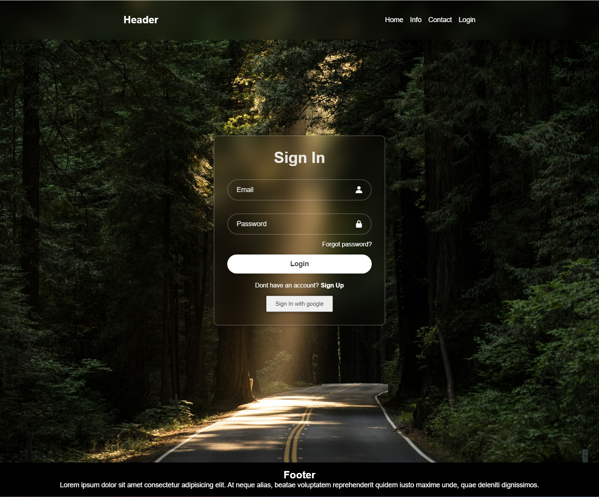

# In this project I will be practicing on things that are important to know if you wanna get a job with React.

- #1 Setting up a project with React router. ✅
- #2 Setting up Firebase. ✅
- #3 Creating an account with alot of inputs (name, password, email, age, language etc..) ✅
- #4 Signing in with email and password (matching with the database) or with google. ✅
- #5 Make a header where you can navigate to different places on the page and check if the user is logged in or admin. ✅
- #6 Homepage where I fetch data from the database and show on the screen (don't know how I wanna show it yet).
- #7 See more information about specific data when you press on it / it takes to you another page.
- #8 Filter and search for data on the homepage.
- #9 Admin page where you can create new data that you want to show on the page.
- #10 Create a chat with socket.
- #11 More coming soon...

- Image below is some progression of what i've done.
